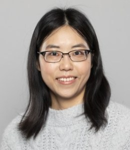
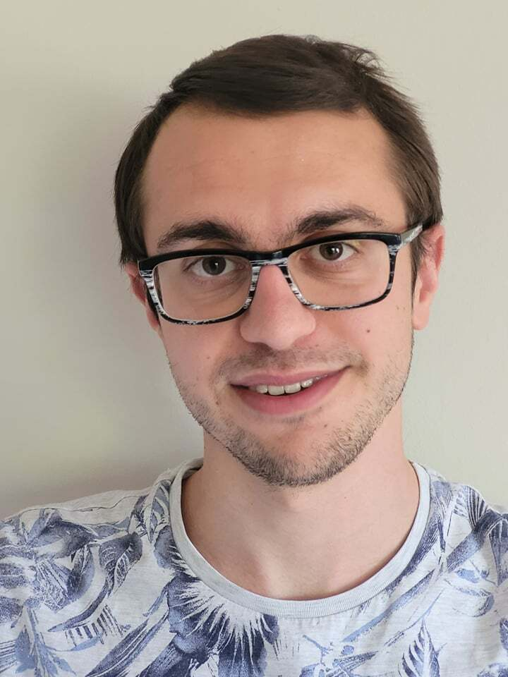
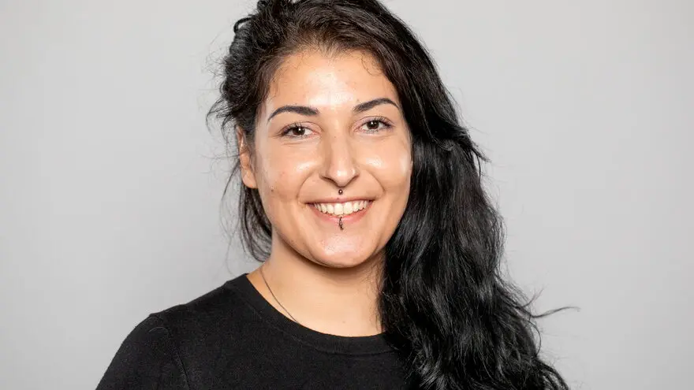
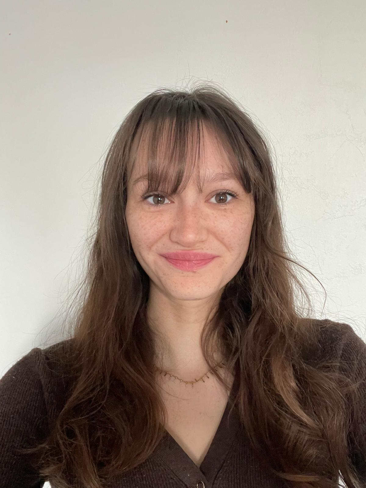
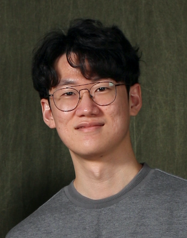
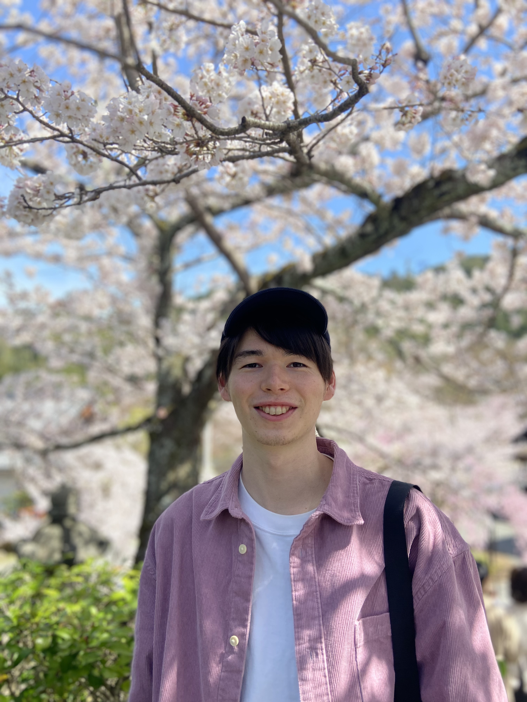
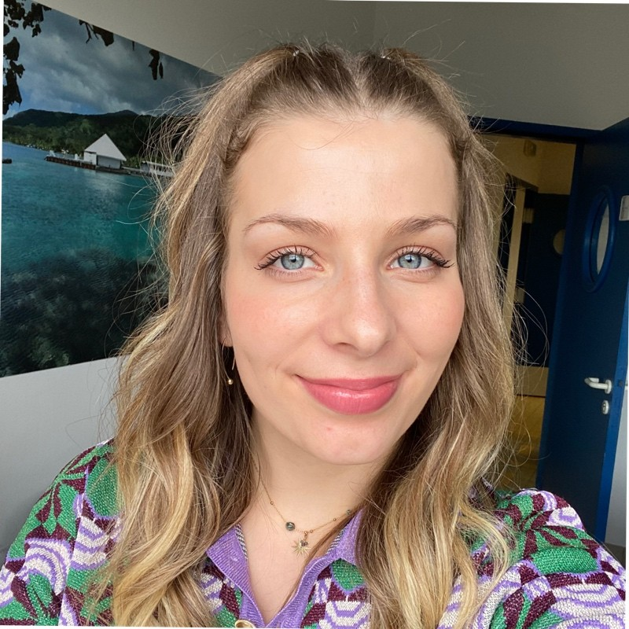

We welcome students, postdoctoral researchers, and visiting researchers who are interested in evolutionary, population, and functional genomics.

## Principal investigator

::: {.person-card .pi-card}
{.person-photo aria-label="Marie Saitou"}

::: {.person-meta}
::: {.person-years}
Since 2020
:::
:::

<h3>Marie Saitou, PhD</h3>Principal investigator

Marie Saitou established the Saitou Lab at NMBU in 2020. She previously held
postdoctoral positions in genetic medicine at the University of Chicago and in
evolutionary genomics at the University at Buffalo. She received her PhD in
Biological Anthropology from the University of Tokyo in 2017.

Her research combines evolutionary, population, comparative, and functional
genomics to study structural variation, gene regulation, adaptation, and the
evolution of biological diversity.

Research profiles: [ORCID](https://orcid.org/0000-0002-8794-3217) · [Google Scholar](https://scholar.google.com/citations?user=QDLB--8AAAAJ)

Social: [researchmap](https://researchmap.jp/mariesaitou) · [ResearchGate](https://www.researchgate.net/profile/Marie-Saitou) · [LinkedIn](https://no.linkedin.com/in/marie-saitou-795819217) · [Bluesky](https://bsky.app/profile/marie-saitou.bsky.social)

[Download CV (PDF, 2026)](output/pdf/Marie_Saitou_CV_2026.pdf).
:::

## Prospective students

::: {.people-list}
::: {.person-card}
::: {.person-photo-placeholder role="img" aria-label="Rytis Plioplys"}
RP
:::

::: {.person-meta}
::: {.person-years}
From 2026
:::
:::

<h3>Rytis Plioplys</h3>MSc student

Rytis is an MSc student in Genome Science at NMBU. His thesis explores the association between telomere length and epigenetic aging in pregnant women using data from the Norwegian Mother, Father and Child Cohort Study (MoBa).

**Co-supervision:** Yunsung Lee (FHI)
:::

::: {.person-card}
::: {.person-photo-placeholder role="img" aria-label="Abu Rahad"}
AR
:::

::: {.person-meta}
::: {.person-years}
From 2026
:::
:::

<h3>Abu Rahad</h3>MSc student

Rahad is an MSc student in the European Joint Master’s in Animal Biodiversity and Genomics (EMABG), NMBU–WUR track. His thesis will focus on identifying and prioritizing cattle genes for increased resistance to bovine viral diarrhea virus (BVDV), integrating CRISPR screening results, single-cell expression data, genetic variation, and CRISPR guide design.

**Co-supervision:** Victor Boyartchuk (NMBU)
:::
:::

## Alumni

::: {.people-list}
::: {.person-card}
{.person-photo aria-label="Célian Diblasi"}

::: {.person-meta}
::: {.person-years}
2022–2026
:::
:::

<h3>Célian Diblasi, PhD</h3>Completed PhD

Structural variants, regulatory evolution, dosage compensation, and eQTLs after whole-genome duplication in Atlantic salmon. Subsequently appointed at Lund University.

**Co-supervision:** Nicola J. Barson and Simen R. Sandve

**Thesis:** [*Structural variants and whole genome duplication in Atlantic salmon evolution*](assets/documents/theses/celian-diblasi-phd-thesis-2026.pdf)

::: {.representative-work}
**Representative publications**

[Large-scale eQTL analyses in Atlantic salmon reveal persistent dosage compensation 100 million years after genome duplication](https://doi.org/10.64898/2025.12.15.694296)  
*bioRxiv* · 2025 · Preprint

[Ancient persistence and recurrent emergence of structural variants across divergent Atlantic salmon lineages](https://doi.org/10.64898/2026.05.25.727466)  
*bioRxiv* · 2026 · Preprint

[Beyond inversions and deletions: the evolutionary and functional insights from translocations, fissions, and fusions in animal genomes](https://doi.org/10.1038/s41437-025-00785-7)  
*Heredity* · 2025
:::
:::

::: {.person-card}
{.person-photo aria-label="Domniki Manousi"}

::: {.person-meta}
::: {.person-years}
2022–2025
:::
:::

<h3>Domniki Manousi, PhD</h3>Completed PhD

The genomic basis of pathogen response, virus resistance, and immune-gene evolution in Atlantic salmon. Subsequently appointed as a postdoctoral researcher at the Roslin Institute, University of Edinburgh.

**Co-supervision:** Sigbjørn Lien and Simen R. Sandve

**Thesis:** [*Genomic Basis of Pathogen Response and Immune Gene Evolution in Atlantic Salmon*](assets/documents/theses/domniki-manousi-phd-thesis-2025.pdf)

**Award: [Best Flash Talk Prize at the 5th International Conference on Integrative Salmonid Biology (2024)](https://cigene.no/news/cigene-at-the-5th-international-conference-on-integrative-salmonid-biology-seattle-march-2024-including-prize-for-best-talk/)**

::: {.representative-work}
**Representative publications**

[Dissecting the genetic basis of response to salmonid alphavirus in Atlantic salmon](https://doi.org/10.1186/s12864-025-11735-2)  
*BMC Genomics* · 2025

[Gene gain and loss drive the diversification of gig immune genes in teleosts: structural and regulatory insights from Atlantic salmon](https://doi.org/10.1016/j.fsi.2025.110975)  
*Fish & Shellfish Immunology* · 2026
:::
:::

::: {.person-card}
{.person-photo aria-label="Maëlys Chapis"}

::: {.person-meta}
::: {.person-years}
2025
:::
:::

<h3>Maëlys Chapis</h3>Master’s intern

Graph-genotyped structural variants and regulatory haplotypes associated with gene expression in Atlantic salmon.

::: {.representative-work}
**Representative publication**

[Imputed graph-genotyped structural variants identify regulatory haplotypes associated with gene expression in Atlantic salmon](https://doi.org/10.64898/2026.06.03.729980)  
*bioRxiv* · 2026 · Preprint
:::
:::

::: {.person-card}
::: {.person-photo .erik-photo role="img" aria-label="Erik Sandertun Røed"}
:::

::: {.person-meta}
::: {.person-years}
2022–2024
:::
:::

<h3>Erik Sandertun Røed</h3>Master’s student

Genetic and epigenetic tools for conservation monitoring of European lobster. Subsequently appointed as a PhD candidate at the University of Oslo.

**Co-supervision:** Louise Chavarie

**Thesis:** [*Evaluating genetic tools to inform conservation efforts for the nationally red-listed European lobster*](assets/documents/theses/erik-sandertun-roed-msc-thesis-2024.pdf)

**Award: [NMBU’s university-wide Best Master’s Thesis Award (2024)](https://www.nmbu.no/studenter/erik-sandertun-roed-vant-pris-beste-oppgave-2024)**

::: {.representative-work}
**Representative publication**

[Resampling-based evaluation of a 79-SNP panel for hybrid classification across generations: a case study in European lobster (*Homarus gammarus*)](https://doi.org/10.1093/g3journal/jkag206)  
*G3: Genes, Genomes, Genetics* · 2026
:::
:::

::: {.person-card}
{.person-photo aria-label="Jun Soung Kwak"}

::: {.person-meta}
::: {.person-years}
2022–2024
:::
:::

<h3>Jun Soung Kwak, PhD</h3>Postdoctoral researcher

Functional genomics of regulatory evolution and vertebrate circadian-rhythm genes. Subsequently appointed Assistant Professor at Kongju National University, South Korea.

**Co-supervision:** Guro K. Sandvik

::: {.representative-work}
**Representative publication**

[Functional and regulatory diversification of *Period* genes responsible for circadian rhythm in vertebrates](https://doi.org/10.1093/g3journal/jkae162)  
*G3: Genes, Genomes, Genetics* · 2024
:::
:::

::: {.person-card}
{.person-photo aria-label="Akira Harding"}

::: {.person-meta}
::: {.person-years}
2023
:::
:::

<h3>Akira Harding</h3>Master’s intern

Metatranscriptomic analysis of host RNA-seq data to characterize microbial dynamics before disease onset in Atlantic salmon aquaculture.

**Co-supervision:** Arturo Vera Ponce De Leon

::: {.representative-work}
**Representative publication**

[Metatranscriptomic Insights into Microbial Dynamics Prior to Disease Onset in Atlantic Salmon Aquaculture](https://doi.org/10.1101/2025.04.15.648526)  
*bioRxiv* · 2025 · Preprint
:::
:::

::: {.person-card}
{.person-photo aria-label="Pauline Buso"}

::: {.person-meta}
::: {.person-years}
2022–2023
:::
:::

<h3>Pauline Buso</h3>Master’s intern

Parallel selection in domesticated Atlantic salmon from divergent founder populations, with emphasis on whole-genome-duplication-derived regions.

**Co-supervision:** Nicola J. Barson

**Report:** [*Identification of selection sweeps following recent domestication: parallel evolution in farmed Atlantic salmon strains from two geographical origins*](assets/documents/reports/pauline-buso-masters-internship-report-2023.pdf)

::: {.representative-work}
**Representative publication**

[Parallel Selection in Domesticated Atlantic Salmon from Divergent Founders Including on Whole-Genome Duplication-derived Homeologous Regions](https://doi.org/10.1093/gbe/evaf063)  
*Genome Biology and Evolution* · 2025
:::
:::
:::
